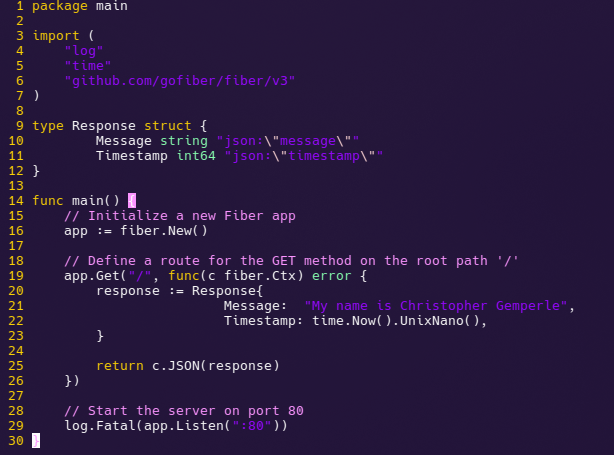

	<source srcset="https://fonts.gstatic.com/s/e/notoemoji/latest/1f40a/512.webp" type="image/webp">
	

<h1 align="center">Liatrio Apprenticeship Exercise</h1>

	
	
	

## Introduction

This project is made as part of the evaluation for the Liatrio Internship. It is a basic web server that sends anyone connecting a Json object containing my name and a Unix timestamp. There's not much to see here but take a look if you'd like. There's also some github actions action going on here.

## Usage

Navigate to the endpoint and let the magic happen:
https://liatrio-my-name-chris-445765978887.us-west1.run.app/

## Screenshots

<table align="center">
  <tr>
	    <td align="center">
Server Code
</td>
    <td align="center">
Docker Hub
</td>
  </tr>
  <tr>
    <td align="center">
Google Cloud Run
</td>
    <td align="center">
Workflow
</td>
  </tr>
</table>

`This app is built using Docker + Alpine Linux.`

